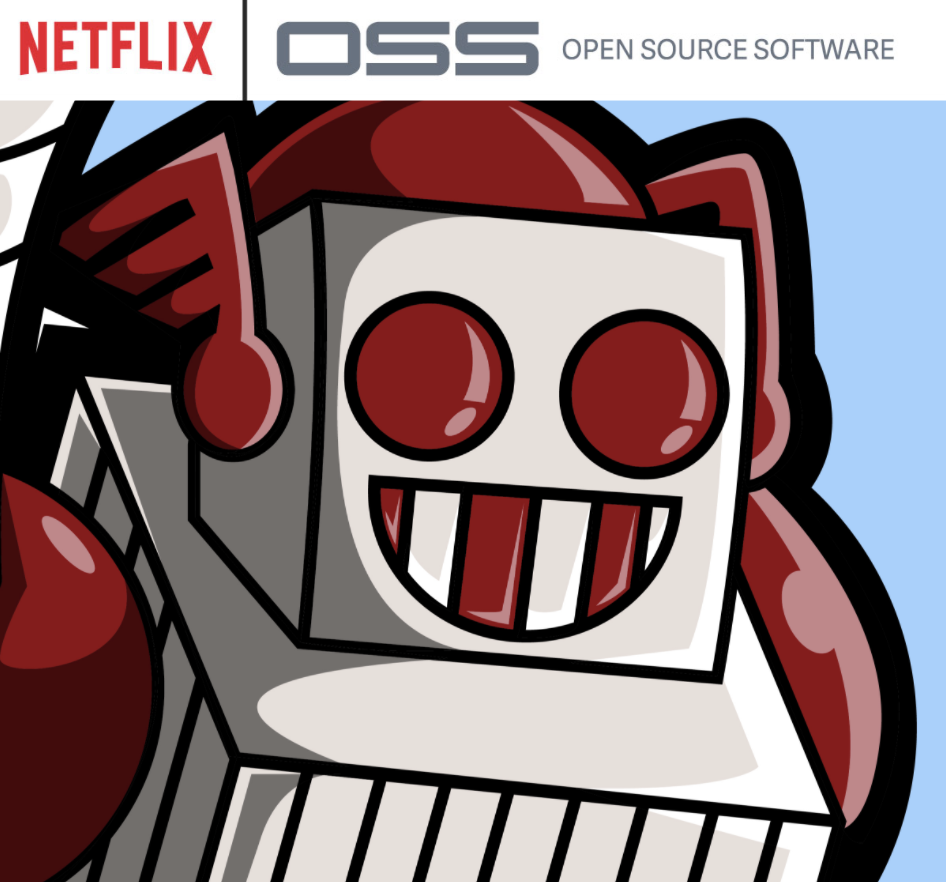
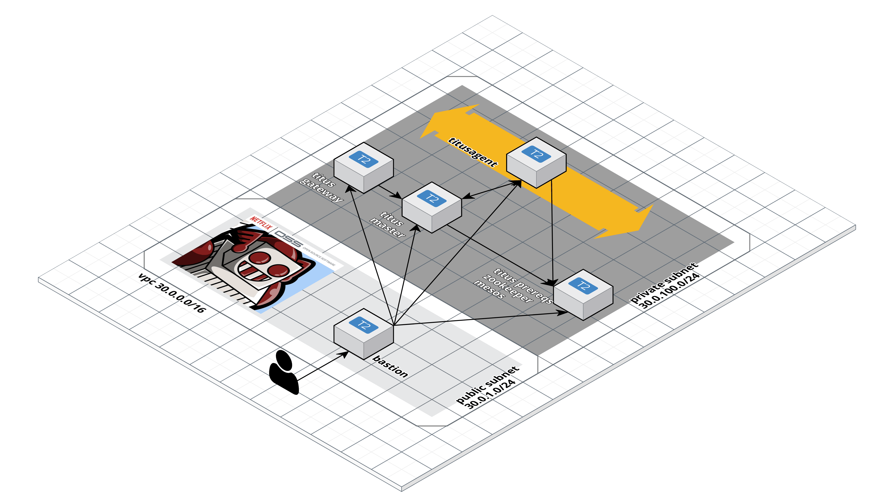

# Titus deployed with terraform
This repository serves as proof of concept for netflix's titus platform.

## What is Titus?


>   Titus is a container management platform that provides scalable and reliable container execution and cloud-native integration with Amazon AWS. Titus was built internally at Netflix and is used in production to power Netflix streaming, recommendation, and content systems.

*source of information: [**netflix.github.io/titus**](https://netflix.github.io/titus/)*

## Motivation
You're wondering why the fuck I'm doing this...
Netflix has demonstrated on countless occasions that as an engineering company they are a reference to follow. After seeing [the announcement that Netflix was releasing titus to the open source community](https://medium.com/netflix-techblog/titus-the-netflix-container-management-platform-is-now-open-source-f868c9fb5436), I had no choice but to try the platform that Netflix uses for its product.

After having deployed platforms with Kubernetes and Openshift, I had to try the Netflix platform, titus, based on Mesos.

## Let's get the fuck on with it.
### Disclaimer
The deployment of titus that we are going to test **is not suitable for a productive environment**. This should serve as a proof of concept for understanding the components of Titus.

### What the fuck are we gonna build?
We are going to deploy a minimal infrastructure using terraform. The component diagram will look like this:




The infrastructure shall contain the following components:

#### EC2
- **Bastion:** It will be our entry point to the Titus platform. We'll use it as a jump host to get to the rest of the nodes. This will be the only machine exposed to the internet *(public subnet)*.
- **Titus prereqs**: This machine contains the requirements set out in [the titus documentation](https://netflix.github.io/titus/install/prereqs/). In this machine are deployed the service of Mesos (master) and Zookeeper (1 single node). To orient the deployment to an environment closer to production, a zookeeper cluster should be created in 3 different availability zones of at least 3 nodes. You must also separate the mesos node and try to deploy it in high availability.
- **Titus Master**: This machine deploys the debian package relative to the titus master. To facilitate the deployment of this infrastructure, the git project containing the titus master was compiled locally and the resulting debian package is uploaded to this same repository under the [deb folder](./deb). Compiled tag: [v0.1.0-rc.57](https://github.com/Netflix/titus-control-plane/tree/v0.1.0-rc.57). [The instructions in the titus manual](https://netflix.github.io/titus/install/master/) have been followed to lift the master. Although to run the binary I use systemd instead of launching the binary by hand.
- **Titus Gateway**: This machine deploys the debian package relative to the titus gateway. To facilitate the deployment of this infrastructure, the git project containing the titus gateway was compiled locally  and the resulting debian package is uploaded to this same repository under the [deb folder](./deb). Compiled tag: [v0.1.0-rc.57](https://github.com/Netflix/titus-control-plane/tree/v0.1.0-rc.57). [The instructions in the titus manual](https://netflix.github.io/titus/install/master/) have been followed to lift the gateway. Although to run the binary I use systemd instead of launching the binary by hand.
- **Titus Agent**: Titus agents or slaves are EC2 machines that must be deployed in an autoscalling group. [The instructions in the titus manual](https://netflix.github.io/titus/install/agent/) have been followed to lift the agent. In the documentation it is described that the file `/etc/mesos-attributes.sh` must be modified to configure it with the data of the machine resources that have been chosen. In this proof of concept we have chosen T2.large instances. To find out how many ENIs and EIPs can be associated with the type of machine selected, you must visit the official [AWS documentation.](https://docs.aws.amazon.com/AWSEC2/latest/UserGuide/using-eni.html). In this example: `ResourceSet-ENIs-3-12` *(3 ENIS and 12 EIPs)*.

#### IAM
Following the netflix tutorial, three IAM roles are created. one of them will be for the instances that run containers and the other two will be roles that the containers will assume.
The role of the instances, in this proof of concept, has administrator permission *(not suitable for production)*. The other two roles (`titusappwiths3InstanceProfile` and `titusappnos3InstanceProfile`) have administrator permissions on S3 (`titusappwiths3InstanceProfile`) and the other on EC2 (`titusappnos3InstanceProfile`).
***This feature has not been tested in this proof of concept.***

The role ARN that appears on the terraform output is the one with administrator privileges over S3 (`titusappwiths3InstanceProfile`).

#### Security Groups
As far as the security groups are concerned, [the netflix documentation](https://netflix.github.io/titus/install/prereqs-amazon/) has been fully followed. It has only been customized to be able to parameterize the reliable IP of the bastion at the entrance of port 22. Also, as the [documentation indicates]((https://netflix.github.io/titus/install/prereqs-amazon/)), the security group called `titusapp` has been customized for the specific use case. In this case you have been given complete freedom from outgoing and only incoming connections from the bastion node using port 22. The security group identifier `titusapp` is displayed on the terraform output.

## Fuck, stop writing and tell me how to execute it.
As requirements, we need to have an amazon account available with enough permissions to create such a cluster, and have terraform installed on our PCs *(jq is needed also)*.
Then, we cloned this wonderful repository and initiated terraform:
```
$ git clone https://github.com/angelbarrera92/titus-terraform.git && cd titus-terraform
$ terraform init
```
Now the party begins....
```bash
$ terraform plan -var public_key=~/.ssh/id_rsa.pub -var trusted_cidr=`curl -s ifconfig.co`/32
...
Plan: 36 to add, 0 to change, 0 to destroy.
...
$ terraform apply -auto-approve -var public_key=~/.ssh/id_rsa.pub -var trusted_cidr=`curl -s ifconfig.co`/32
...
Apply complete! Resources: 36 added, 0 changed, 0 destroyed.

Outputs:

agent_asg_name = titusagent
bastion_ip = 34.245.<PRIVATE>
default_role_arn = arn:aws:iam::<PRIVATE>:role/titusappwiths3InstanceProfile
default_sg_id = sg-<PRIVATE>
gateway_ip = 30.0.100.130
master_ip = 30.0.100.24
prereqs_ip = 30.0.100.194
...
$ aws ec2 describe-instances --filters "Name=tag:aws:autoscaling:groupName,Values=titusagent" "Name=instance-state-name,Values=running" | jq -r .Reservations[].Instances[].PrivateIpAddress
30.0.100.195
```
Now you will have all the data to start playing.

### Set up your ssh connection
We're going to use the bastion as a jump host. This is why we will configure it in our ssh connection configuration file. If you look, all connections to IPs 30.0.* will go against the jump settings.

```bash
$ cat ~/.ssh/config
Host 30.0.*
    User ubuntu
    ProxyCommand ssh ubuntu@34.245.<PRIVATE> nc %h %p
```
*Be careful not to get into conflict with any of your ssh settings.*

### Let's make sure everything's up.
#### prereqs Machine
First we must go to the prerequisite machine:
```
$ ssh terraform output prereqs_ip
ubuntu@ip-30-0-100-194:~$ docker ps
CONTAINER ID        IMAGE                                             COMMAND                  CREATED             STATUS              PORTS                                        NAMES
758a742b4308        mesosphere/mesos-master:1.0.1-2.0.93.ubuntu1404   "mesos-master mesos-…"   15 seconds ago      Up 14 seconds                                                    mesomaster
72a3d170f460        jplock/zookeeper:3.4.10                           "/opt/zookeeper/bin/…"   38 seconds ago      Up 38 seconds       2888/tcp, 0.0.0.0:2181->2181/tcp, 3888/tcp   zookeeper
```
And we must check that the docker daemon is working and two containers are up, `mesos master` and a `zookeeper`.

#### titus master
Now we must go to the titus master node and check that the service is alive:
```
$ ssh `terraform output master_ip`
ubuntu@ip-30-0-100-24:~$ service titus-server-master status
● titus-server-master.service - Titus Master
   Loaded: loaded (/lib/systemd/system/titus-server-master.service; enabled; vendor preset: enabled)
   Active: active (running)
```
We can check that the service is marked as active

#### titus gateway
We'll check the status of the api gateway.
```
$ ssh `terraform output gateway_ip`
ubuntu@ip-30-0-100-130:~$ service titus-server-gateway status
● titus-server-gateway.service - Titus Gateway
   Loaded: loaded (/lib/systemd/system/titus-server-gateway.service; enabled; vendor preset: enabled)
   Active: active (running)
```
We can check that the service is marked as active. We'll be back to this node soon.

#### titus agent
Finally, we will check the condition of the slave.
```
$ ssh `aws ec2 describe-instances --filters "Name=tag:aws:autoscaling:groupName,Values=titusagent" "Name=instance-state-name,Values=running" | jq -r .Reservations[].Instances[].PrivateIpAddress`
service mesos-agent status
● mesos-agent.service - Mesos
   Loaded: loaded (/lib/systemd/system/mesos-agent.service; enabled; vendor preset: enabled)
   Active: active (running)
```

We can check that the service is marked as active. We'll be back to this node soon.

### The game begins
We get inside the gateway node:
```
$ ssh `terraform output gateway_ip`
```
And we execute the following request to the api:
```
ubuntu@ip-30-0-100-130:~$ curl localhost:7001/api/v3/agent/instanceGroups/titusagent/lifecycle \
  -X PUT -H "Content-type: application/json" -d \
  '{"instanceGroupId": "titusagent", "lifecycleState": "Active"}'
```
This request indicates that our autoscalling group is ready to receive jobs. we can check the state of it:
```
ubuntu@ip-30-0-100-130:~$ curl localhost:7001/api/v3/agent/instanceGroups/titusagent
{
  "id": "titusagent",
  "instanceType": "t2.large",
  "instanceResources": {
    "cpu": 0,
    "gpu": 0,
    "memoryMB": 0,
    "diskMB": 0,
    "networkMbps": 0
  },
  "tier": "Flex",
  "min": 0,
  "desired": 1,
  "current": 1,
  "max": 1,
  "isLaunchEnabled": false,
  "isTerminateEnabled": false,
  "autoScaleRule": {
    "min": 0,
    "max": 1000,
    "minIdleToKeep": 2,
    "maxIdleToKeep": 5,
    "coolDownSec": "600",
    "priority": 100,
    "shortfallAdjustingFactor": 8
  },
  "lifecycleStatus": {
    "state": "Active",
    "detail": "",
    "timestamp": "1525719016939"
  },
  "launchTimestamp": "1525718936792",
  "attributes": {
  }
}
```

Now we'll launch an example job. ***Please replace the <PRIVATE> values with your real values.***
```
ubuntu@ip-30-0-100-130:~$ curl localhost:7001/api/v3/jobs \
  -X POST -H "Content-type: application/json" -d \
  '{
    "applicationName": "localtest",
    "owner": {"teamEmail": "me@me.com"},
    "container": {
      "image": {"name": "alpine", "tag": "latest"},
      "entryPoint": ["/bin/sleep", "1h"],
      "securityProfile": {"iamRole": "arn:aws:iam::<PRIVATE>:role/titusappwiths3InstanceProfile", "securityGroups": ["sg-<PRIVATE>"]}
    },
    "batch": {
      "size": 1,
      "runtimeLimitSec": "3600",
      "retryPolicy":{"delayed": {"delayMs": "1000", "retries": 3}}
    }
  }'
```
Now we must go to the only slave we have and check that there is a docker container running.
```
$ ssh `aws ec2 describe-instances --filters "Name=tag:aws:autoscaling:groupName,Values=titusagent" "Name=instance-state-name,Values=running" | jq -r .Reservations[].Instances[].PrivateIpAddress`
ubuntu@ip-30-0-100-140:~$ docker ps
CONTAINER ID        IMAGE               COMMAND             CREATED             STATUS              PORTS               NAMES
ba08bde76fdf        alpine:latest       "/bin/sleep 1h"     57 seconds ago      Up 56 seconds                           57bf28b1-8393-4afb-900e-33e371e92b50
```
And effectively, we have a docker container running. And that's all for now. **We have tested the deployment of a job on the Netflix infrastructure, titus.**

### Switching off
Let's destroy the infrastructure
```
$ terraform destroy --force
...
Destroy complete! Resources: 36 destroyed.
```

## Problems encountered
During the construction of this proof of concept, several problems have been encountered. Luckily, the titus development team has exposed a [public slack channel](https://titusoss.herokuapp.com/) where I found personalized help ;)

### Metatron
Once the infrastructure was set up, launching a sample job would cause an error in the logs of the mesos agent:

```bash
$ cat /var/lib/mesos/slaves/64b1f518-f8d6-4f21-8d4f-39360b8f12f2-S0/frameworks/TitusFramework/executors/docker-executor/runs/latest
Cannot create Titus executor: Failed to initialize Metatron trust store: lstat /metatron: no such file or directory
```

The titus development team mentioned a possible solution to me. Create the file `/etc/profile.d/titus_environment.sh` in the agent whose content was: `METATRON_ENABLED=false`
This didn't work or not at all. The solution, rudimentary, I found in desperation: `touch /metatron`. This solution is implemented in the [initialization script of mesos agents](./scripts/cloud-init-agent.yml.tpl) so this error should not occur again.

### instanceGroups activation
Again, when we tried to start a job, we found that it did not start the job. But again, the Netflix team referred me to more (somewhat fragmented???) [documentation](https://github.com/Netflix/titus-control-plane).

> By default, all titus-agent containers will join a cluster named unknown-instanceGroup. Before any tasks can be scheduled, that cluster needs to be activated. Note that this is necessary every time the Titus master is restarted, since instanceGroup state is not being persisted:

So you must launch that request to the api rest, important, from the titus gateway node. If you have used the default variables of this terraform project, the request will be:

```bash
$ curl localhost:7001/api/v3/agent/instanceGroups/titusagent/lifecycle \
  -X PUT -H "Content-type: application/json" -d \
  '{"instanceGroupId": "titusagent", "lifecycleState": "Active"}'
```

*Note: replace `titusagent` if you change the default variables*

### Job examples
Well, once the group of instances of the mesos agents is activated, we proceed to follow the [titus tutorial](https://netflix.github.io/titus/test/batch/) to launch a job.

A new problem arises, the examples are written for the API in version 2. But this version of the API is disabled, with version 3 being the active version. *(data provided by netflix engineers @ [slack](https://titusoss.herokuapp.com/))*. So again, we must go to [other documentation](https://github.com/Netflix/titus-control-plane) to look for a valid example *(api version 3)*.

## Documentation to have on the radar
- https://queue.acm.org/detail.cfm?id=3158370
- https://medium.com/netflix-techblog/titus-the-netflix-container-management-platform-is-now-open-source-f868c9fb5436
- https://www.youtube.com/watch?v=ySdqDGfEOHo
- https://www.youtube.com/watch?v=4OLlKGT7aVQ *(fully recommended)*
- https://www.youtube.com/watch?v=6QLMvBkJtOU
- https://www.infoq.com/news/2018/04/titus-container-platform
- https://github.com/Netflix/titus-control-plane
- https://github.com/Netflix/titus-api-definitions/blob/master/doc/titus-v3-spec.md
